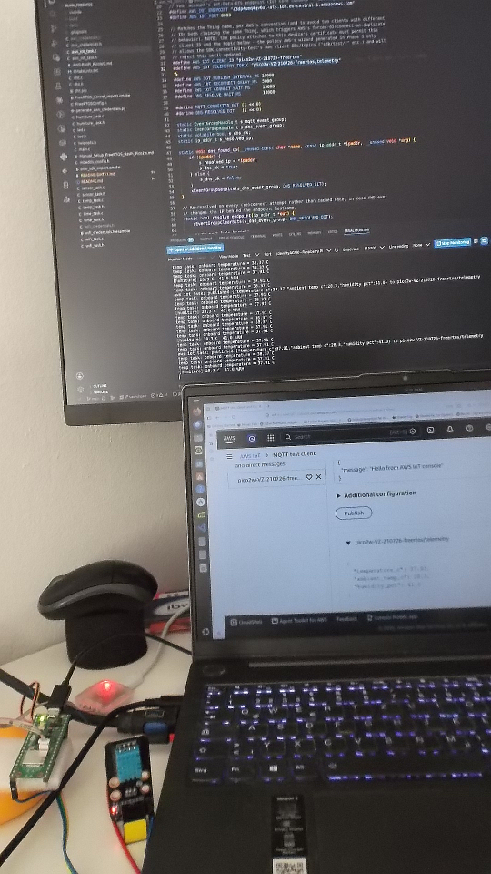
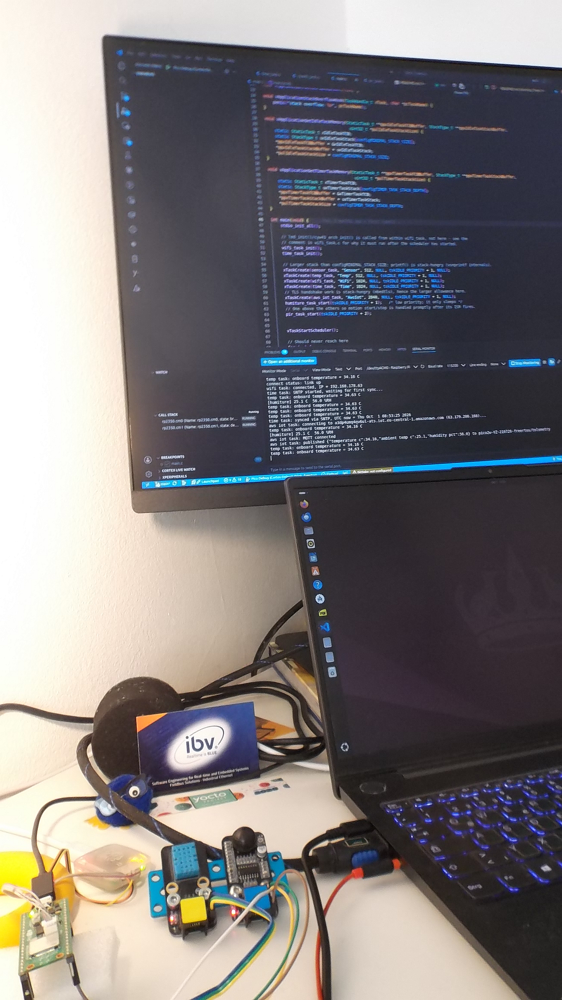
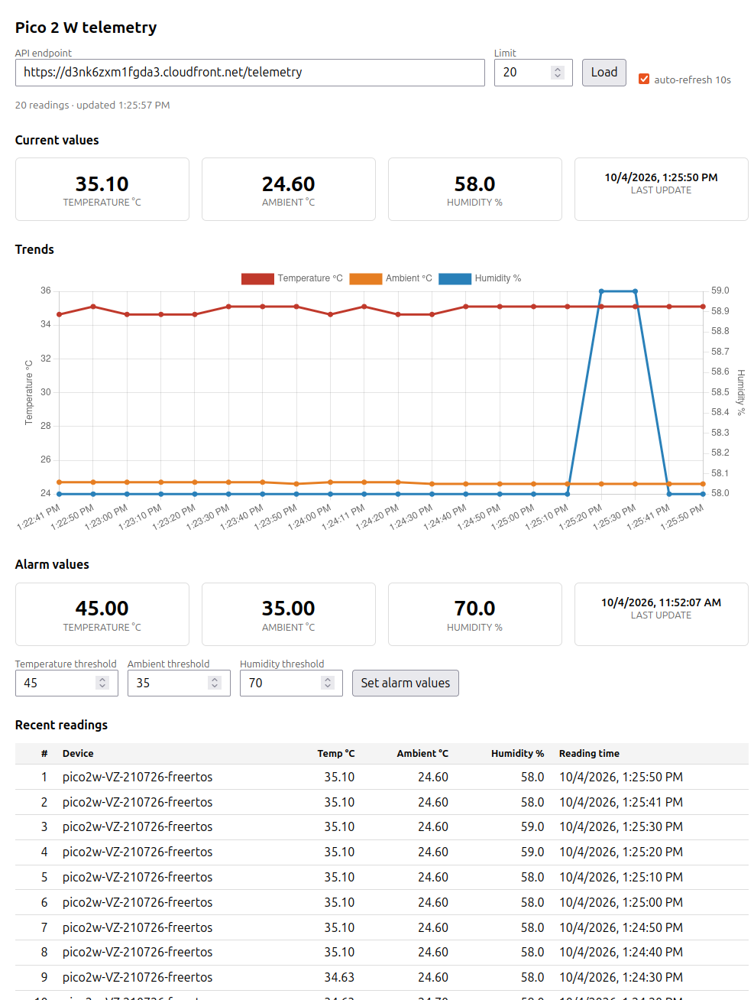

# FreeRTOS on Raspberry Pi Pico 2 W: AWS IoT telemetry + LAN motion events

FreeRTOS on a Raspberry Pi Pico 2 W (RP2350 + CYW43439 WiFi), starting from a blinking LED and
growing into two independent pipelines running side by side on one board:

- **Cloud telemetry** — onboard die temperature + DHT11 humidity/ambient temperature, published
  over mutual-TLS MQTT to AWS IoT Core, then fanned out by IoT Rules into an SQS queue *and* into
  DynamoDB, where a serverless REST API feeds a password-protected HTTPS dashboard with
  Chart.js graphs and configurable alarm thresholds.
- **LAN motion events** — a PIR sensor's events published over plain MQTT to a Mosquitto broker
  on a Raspberry Pi 4B on the same subnet, feeding a VMS. This path waits only for WiFi, so
  motion keeps reaching the Pi even when the internet (or AWS) is down.

A hardware-watchdog supervisor sits underneath both, rebooting the board if WiFi stays down or a
monitored task stops checking in.

Built with the [Raspberry Pi Pico VS Code extension](https://marketplace.visualstudio.com/items?itemName=raspberry-pi.raspberry-pi-pico),
Pico SDK 2.3.0, and the FreeRTOS-Kernel `RP2350_ARM_NTZ` SMP port.

<p align="center">
  
  <br><em>The board and its sensors</em>
</p>

<p align="center">
  
  <br><em>The board and its sensors</em>
</p>

<p align="center">
  
  <br><em>The telemetry dashboard (<a href="docs/AWS-Telemetry-WebUI.md">AWS-Telemetry-WebUI.md</a>)</em>
</p>

## What's here

- **WiFi station connection** with automatic reconnect (`wifi_task`)
- **SNTP time sync**, required before any TLS certificate validity check can succeed (`time_task`)
- **Mutual-TLS MQTT client** to AWS IoT Core — device certificate + private key, server identity
  verified against the Amazon Root CA (`aws_iot_task`)
- **Telemetry Web UI** — a second IoT Rule stores every reading in DynamoDB via Lambda; a REST
  API (API Gateway + Lambda) serves it to a Chart.js line-graph dashboard, fronted by CloudFront
  for HTTPS and a password gate (`aws_backend/`, `web_ui/`) — no firmware changes needed for the
  core pipeline, runs alongside the existing SQS path
- **Configurable alarm thresholds** — per-reading alarm flags for die temperature, ambient
  temperature and humidity, computed server-side at ingest against thresholds you set from the
  dashboard, shown as red values on the live tiles and in the readings table
- **Sensor telemetry**:
  - RP2350's internal die temperature sensor (`temp_task`)
  - DHT11 humidity + ambient temperature over a PIO-based single-wire driver (`humiture_task`,
    `dht.c/h/.pio`) — no bit-banging, no interrupt-masking, the PIO state machine does the
    microsecond-level timing in hardware while the task just sleeps
  - Makeblock Me PIR Motion Sensor v1.1, interrupt driven: GPIO edge ISR → queue → task, with
    weak `pir_on_motion_start()` / `pir_on_motion_stop()` hooks (`pir_task`, driver `pir.c/h`)
  - I2C MPU6050 accelerometer example, not currently wired to real hardware (`sensor_task`)
- **AWS IoT Rule → SQS** — telemetry is routed from the device's MQTT topic into an SQS queue for
  downstream consumption, independent of the MQTT test client
- **LAN MQTT to a Raspberry Pi 4B** — PIR events, state and an online/offline status are published
  to Mosquitto on the LAN over plain MQTT, and a retrigger-mode command is accepted back
  (`lan_mqtt_task`). Deliberately independent of SNTP and of the AWS path: it waits for WiFi only,
  so motion keeps flowing while the internet is down. Interface contract in
  [PIR-MQTT-VMS-Pico.md](docs/PIR-MQTT-VMS-Pico.md) §3
- **Hardware-watchdog supervisor** (`watchdog_task`) — feeds the RP2350 watchdog once a second
  while WiFi has been up within the last 4 minutes and every monitored task (`WiFi`, `pir`,
  `LanMqtt`) is checking in; otherwise it records the reason in a scratch register and resets,
  printing why after the reboot. If the supervisor itself dies, the hardware watchdog catches it —
  which also turns a HardFault, `panic()` or failed assert into a reboot instead of a dead board.
  Build with `-DWATCHDOG_ENABLED=0` to keep the checks and messages but never reset

## Hardware

| | |
|---|---|
| Board | Raspberry Pi Pico 2 W (RP2350, Cortex-M33, CYW43439 WiFi/BT) |
| DHT11 | Makeblock Me Humiture Sensor (a DHT11 clone) — DATA on GPIO15, 3V3, GND. See [README-DHT11.md](docs/README-DHT11.md) for wiring, voltage-level details, and why this uses PIO instead of bit-banging. |
| PIR | Makeblock Me PIR Motion Sensor v1.1 — OUT (S2) on GPIO14, MODE (S1) on GPIO13, VCC from VBUS (5 V), GND. Output high level is ~3.8 V; see [README-PIR.md](docs/README-PIR.md) for why that is fine on a non-ADC GPIO. |
| MPU6050 | I2C0, SDA=GPIO4, SCL=GPIO5 — driver present, not physically wired |
| Debug | Raspberry Pi Debug Probe (CMSIS-DAP + UART bridge) |

## Building and flashing

This project is set up for the Pico VS Code extension, which manages the SDK/toolchain/FreeRTOS-Kernel
under `~/.pico-sdk` and provides the CMake kit. From VS Code:

1. **Compile Project** (build task) — runs `ninja -C build`.
2. **Run Project** / **Flash** (build tasks in `.vscode/tasks.json`) — flashes via `picotool` or
   OpenOCD + Debug Probe.
3. **Pico Debug (Cortex-Debug)** (Run and Debug panel, F5) — OpenOCD + GDB via the Debug Probe.
4. **Reset and Run** (task) — resumes a core left halted by a debug session.

That last one matters more than it sounds. `launch.json` sets `runToEntryPoint: "main"`, so every
debug launch **halts at `main`** and waits. Close the session without pressing Continue and the
board is left stopped: no LED, no serial, nothing published — and it stays that way, because the
watchdog's `pause_on_debug` deliberately freezes while a debugger owns the core. Run the
**Reset and Run** task (or just power-cycle) to revive it. Flashing via the **Flash** task does not
have this problem: its `program ... verify reset exit` includes the reset.

Serial output is on UART (via the Debug Probe's UART bridge), not USB CDC — USB stdio is disabled
(see the comment in `CMakeLists.txt` for why). Connect at 115200 8N1:
```bash
picocom -b 115200 /dev/ttyACM<N>   # find the right port with: ls /dev/ttyACM*
```

Command-line equivalent, if not using the extension:
```bash
cmake -S . -B build
cmake --build build
```

## Configuration required before first build

These are gitignored and must be created locally — the project won't build/run without them:

**1. WiFi credentials** (always required)
```bash
cp config/wifi_credentials.h.example config/wifi_credentials.h
# then edit config/wifi_credentials.h with your actual SSID/password
```

**2. LAN MQTT broker config** (required for the `lan_mqtt_task`/PIR path)
```bash
cp config/lan_mqtt_config.h.example config/lan_mqtt_config.h
# then edit it with the broker's IP, user and password
```
The broker address is compiled in, so the Pi needs a fixed IPv4 address on the router — see
[PIR-MQTT-VMS-Pico.md](docs/PIR-MQTT-VMS-Pico.md) §3.1.

**3. AWS IoT Core credentials** (only needed if you want the `aws_iot_task`/telemetry path — the
rest of the project builds and runs without AWS at all)
- Create a Thing, device certificate, and policy in AWS IoT Core.
- Drop the device certificate, private key, and Amazon Root CA as PEM files into `certs/`.
- Update the endpoint/client ID/topic constants at the top of `aws_iot_task.c`.
- Generate the embedded credential arrays:
  ```bash
  python3 tools/generate_aws_credentials.py
  ```
  This reads `certs/*.pem` and writes `aws_credentials.c` (gitignored — it embeds the private key).

Full step-by-step AWS setup, including the IoT policy pitfalls and how to test with the AWS CLI,
is in [AWS-RasPi_PicoW2.md](docs/AWS-RasPi_PicoW2.md).

## Project layout

```
blink_freertos/
├── src/          firmware: main.c + one task per concern
├── drivers/      hardware drivers, no FreeRTOS dependency
├── config/       build-time tunables and credentials
├── cloud/        everything that runs in AWS, not on the board
├── docs/         design docs, debugging write-ups, images
├── tools/        helper scripts
├── certs/ *      raw PEM files from AWS IoT Core
└── CMakeLists.txt
```

Quoted includes resolve through `src/`, `drivers/` and `config/`, which `CMakeLists.txt` puts on
the include path — so sources use plain `#include "wifi_task.h"` with no directory prefixes.

### `src/` — firmware

| File | Role |
|---|---|
| `main.c` | Task creation, FreeRTOS hooks (`vApplicationMallocFailedHook` etc.) |
| `wifi_task.c/h` | WiFi station connect + auto-reconnect; `wifi_wait_connected()` |
| `time_task.c/h` | SNTP time sync; `time_wait_synced()`; drives `settimeofday()` |
| `aws_iot_task.c/h` | DNS resolve, mutual-TLS MQTT connect, periodic publish, auto-reconnect |
| `lan_mqtt_task.c/h` | PIR events, state and online status to the Mosquitto broker on the Raspberry Pi 4B (plain MQTT on the LAN); see [PIR-MQTT-VMS-Pico.md](docs/PIR-MQTT-VMS-Pico.md) |
| `watchdog_task.c/h` | Hardware-watchdog supervisor: resets after 4 min without Wi‑Fi or when a monitored task stops checking in; reports the reason after the reboot |
| `temp_task.c/h` | Internal RP2350 temperature sensor; feeds telemetry |
| `humiture_task.c/h` | FreeRTOS task wrapping the DHT11 driver; feeds telemetry |
| `pir_task.c/h` | FreeRTOS task wrapping the PIR driver: motion start/stop hooks, `pir_get_status()` |
| `sensor_task.c/h` | I2C MPU6050 example (independent of the AWS IoT path) |
| `led.c/h` | LED as WiFi connection indicator |

### `drivers/` — hardware

| File | Role |
|---|---|
| `dht.c/h`, `dht.pio` | PIO-based DHT11/DHT22 single-wire driver |
| `pir.c/h` | PIR motion sensor driver: pins, trigger mode, GPIO edge ISR (no FreeRTOS) |

### `config/` — tunables and credentials

| File | Role |
|---|---|
| `FreeRTOSConfig.h` | FreeRTOS-Kernel configuration for the RP2350 SMP port |
| `lwipopts.h` | lwIP configuration (SNTP, MQTT, TLS-over-altcp tuning) |
| `mbedtls_config.h` | mbedtls configuration (TLS 1.2, ciphersuites, buffer sizing) |
| `wifi_credentials.h`* / `.h.example` | WiFi SSID/password |
| `lan_mqtt_config.h`* / `.h.example` | LAN broker address, user and password |
| `aws_credentials.h` / `aws_credentials.c`* | Embedded cert/key/root-CA byte arrays (`.c` generated) |

### `cloud/`, `docs/`, `tools/`

| Path | Role |
|---|---|
| `cloud/aws_backend/` | Lambda sources (store/get telemetry, set alarm thresholds), IAM/bucket policies, IoT Rule, CloudFront config (see [AWS-Telemetry-WebUI.md](docs/AWS-Telemetry-WebUI.md)) |
| `cloud/web_ui/index.html` | Browser dashboard (value tiles, Chart.js line graph, readings table, alarm thresholds), deployed to S3, served via CloudFront (HTTPS + password gate) |
| `tools/generate_aws_credentials.py` | Regenerates `config/aws_credentials.c` from `certs/*.pem` |
| `docs/` | All design and debugging documents — see [Documentation](#documentation) below |

\* gitignored — see [Configuration](#configuration-required-before-first-build) above.

## Documentation

- **[Manual_Setup_FreeRTOS_RasPi_Pico2w.md](docs/Manual_Setup_FreeRTOS_RasPi_Pico2w.md)** — getting a
  bare FreeRTOS project actually building and running on the Pico 2 W: every bug hit standing this
  up from a manually-assembled project, plus how to read fault registers and the vector table
  directly via a debug probe.
- **[AWS-RasPi_PicoW2.md](docs/AWS-RasPi_PicoW2.md)** — the full AWS IoT Core integration: plan,
  phase-by-phase implementation, every bug and its root cause (including a genuinely nasty mbedtls
  buffer-sizing bug), the IoT Rule → SQS pipeline, a `jq`/AWS CLI primer, and a reusable
  GDB/cortex-debug manual for debugging live network/TLS code.
- **[README-DHT11.md](docs/README-DHT11.md)** — DHT11 wiring, voltage-level reasoning, and why the
  driver uses PIO instead of bit-banging under FreeRTOS with WiFi/TLS running concurrently.
- **[README-PIR.md](docs/README-PIR.md)** — PIR wiring, the 3.8 V output level vs. RP2350 GPIO
  ratings, and the ISR → queue → task design sharing `IO_IRQ_BANK0` with the CYW43 driver.
- **[PIR-MQTT-VMS-Pico.md](docs/PIR-MQTT-VMS-Pico.md)** — the Pico side of the PIR → MQTT → VMS chain:
  analysis, design decisions (including D14, the watchdog), and the §3 interface contract the
  Raspberry Pi relies on. The authoritative document for the LAN path.
- **[MQTT_RASPI_4B_Pico2W.md](docs/MQTT_RASPI_4B_Pico2W.md)** — getting PIR motion events from the
  Pico 2 W to the Pi 4B with minimal delay: transport options considered and the broker setup.
- **[PIR-MQTT-VMS-OLD.md](docs/PIR-MQTT-VMS-OLD.md)** — superseded by the two above; kept for
  reference only, don't implement from it.
- **[AWS-Telemetry-WebUI.md](docs/AWS-Telemetry-WebUI.md)** — the DynamoDB + Lambda + API Gateway +
  CloudFront telemetry dashboard: architecture, design decisions (DynamoDB over RDS,
  `topic()`-derived `device_id`, CloudFront Function Basic Auth over Cognito, alarm flags stamped
  server-side at ingest), every resource created, a real intermittent-sensor debugging story,
  verification performed, and redeploy commands (including rotating the dashboard password and
  changing alarm thresholds from the CLI).

## Security notes

- `certs/`, `wifi_credentials.h`, `lan_mqtt_config.h` and `aws_credentials.c` are all gitignored.
  Never commit them — `aws_credentials.c` embeds your device's private key, and
  `lan_mqtt_config.h` holds the Mosquitto broker password.
- **The LAN MQTT path is plain MQTT on port 1883, unencrypted.** Credentials and payloads cross
  the LAN in the clear; the broker's ACL restricts the `pico` user to its own topic prefix, which
  limits damage but is not confidentiality. Acceptable on a trusted home subnet, not beyond it —
  see [PIR-MQTT-VMS-Pico.md](docs/PIR-MQTT-VMS-Pico.md).
- The current mbedtls config trades away TLS hostname verification against AWS IoT's server
  certificate (see AWS-RasPi_PicoW2.md §5.6 for why, and the tradeoff involved) — the certificate
  chain is still fully verified against the Amazon Root CA, but the CN/SAN isn't checked against
  the endpoint hostname. Revisit before using this as a template for anything more
  security-sensitive.
- `aws_backend/cloudfront_basic_auth_function.js` (the dashboard's real login credential) is
  gitignored, same pattern as above — only the placeholder `.js.example` is committed. See
  [AWS-Telemetry-WebUI.md](docs/AWS-Telemetry-WebUI.md) §7 for the tradeoffs of the Basic Auth
  approach itself (shared single-user password, credential stored in cleartext at the edge).

## License

[MIT](LICENSE)
