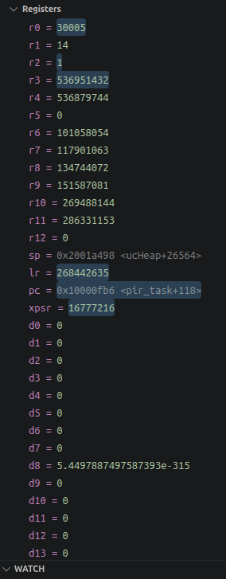

# Reading Cortex-M33 Registers on the Pico 2 W

What the CPU registers in the debugger's **Registers** pane mean on an RP2350, and how to get
real information out of them. Worked through on one actual snapshot taken while halted in
`pir_task`, because a concrete example says far more than a register table alone.

The Pico 2 W's RP2350 has two Cortex-M33 cores (plus two RISC-V Hazard3 cores you can switch to
instead — this project uses the ARM port, `RP2350_ARM_NTZ`, where **NTZ = No TrustZone**, which
avoids the banked secure/non-secure stack pointers an M33 otherwise has).

---

## 1. The snapshot

<p align="center">
  
</p>

Halted at `pc = 0x10000fb6 <pir_task+118>`. The debugger shows most values in decimal, which hides
almost everything useful — the first move is always to convert to hex.

---

## 2. The register set

| Register | Role under the ARM calling convention (AAPCS) |
|---|---|
| `r0`–`r3` | First four function arguments; `r0` also carries the return value. **Caller-saved**: a callee may clobber them freely |
| `r4`–`r11` | Local variables. **Callee-saved**: a function must preserve them, so they survive across calls |
| `r12` | Scratch (`IP`), used by the linker for long-branch veneers |
| `sp` (`r13`) | Stack pointer. The M33 has two — `MSP` for interrupts, `PSP` for threads. FreeRTOS runs tasks on `PSP`, handlers on `MSP` |
| `lr` (`r14`) | Link register: the return address written by `bl` |
| `pc` (`r15`) | Program counter |
| `xpsr` | Status: condition flags, the Thumb bit, and `IPSR` = which exception is active (0 = thread mode) |
| `d0`–`d13` | FPU registers — but see §4.4, they are not what they appear to be |

---

## 3. Decoding this snapshot

Converted to hex, the values stop looking random:

| Register | Decimal (as shown) | Hex | What it actually is |
|---|---|---|---|
| `r0` | 30005 | `0x00007535` | return value of `xTaskGetTickCount()` |
| `r1` | 14 | `0x0000000E` | `PIR_GPIO` |
| `r2` | 1 | `0x00000001` | `WATCHDOG_CLIENT_PIR` |
| `r3` | 536951432 | `0x20013A88` | pointer into `.bss` statics |
| `r4` | 536879744 | `0x20002280` | `s_status` (`pir_task.c`'s own static) |
| `r6`–`r11` | — | `0x06060606` … `0x11111111` | FreeRTOS register preload fill |
| `sp` | — | `0x2001A498` | `ucHeap + 26564` |
| `lr` | 268442635 | `0x10001C0B` | stale, inside `watchdog_checkin` |
| `pc` | — | `0x10000FB6` | `pir_task`, `pir_task.c:161` |
| `xpsr` | 16777216 | `0x01000000` | Thumb bit only; thread mode |

### 3.1 `pc` — executing from flash

`0x10000000` is the XIP flash base on RP2350, so this is running from flash, not SRAM. Resolved,
it is [`src/pir_task.c:161`](../src/pir_task.c#L161) — the `watchdog_checkin(WATCHDOG_CLIENT_PIR)`
at the top of the task's main loop.

### 3.2 `sp` — proof this is a FreeRTOS task stack

`sp = 0x2001a498`, which the debugger annotates `<ucHeap+26564>`. `ucHeap` is heap_4's pool, and
`xTaskCreate()` carves task stacks out of it — so a stack pointer inside `ucHeap` means we are on a
task (on `PSP`), not on the main stack. Confirmed exactly: `ucHeap` is at `0x20013cd4`, and
`0x2001a498 − 0x20013cd4 = 26564`.

### 3.3 `r6`–`r11` — a fill pattern, not data

`0x06060606`, `0x07070707`, `0x08080808`, `0x09090909`, `0x10101010`, `0x11111111` is FreeRTOS's
`portPRELOAD_REGISTERS` fill, written into a task's initial stack frame by
`pxPortInitialiseStack()` precisely so that these show up recognisably in a debugger.

Because `r6`–`r11` are callee-saved and still hold the fill, **this task has never needed them**.
`r4`/`r5` by contrast have been used: `r4 = 0x20002280` is `s_status`, a static in `pir_task.c`.

### 3.4 `r0`, `r1`, `r2` — the live arguments

These corroborate each other and the source:

- `r2 = 1` is `WATCHDOG_CLIENT_PIR` (the enum is `WIFI=0, PIR=1, LAN_MQTT=2`) — the literal
  argument being passed on line 161.
- `r0 = 30005` is the tick count. At `configTICK_RATE_HZ 1000` that is **30.005 s since boot**, and
  `PIR_WARMUP_MS` is 30000 — so this halt caught the task within 5 ms of finishing its warm-up and
  entering the loop for the first time.
- `r1 = 14` is `PIR_GPIO`.

### 3.5 `xpsr` — thread mode, no flags

`0x01000000` has only bit 24 set: the **T (Thumb)** bit, which is always set on Cortex-M because it
executes Thumb only. `IPSR` (the low bits) is 0, meaning **thread mode** — not inside an interrupt
handler. No condition flags set.

---

## 4. Four things that mislead

### 4.1 `lr` is not "who called me"

`lr = 0x10001C0B` is odd because **bit 0 is the Thumb bit** — clear it to get the real address
`0x10001C0A`, which resolves to [`src/watchdog_task.c:73`](../src/watchdog_task.c#L73).

That is *inside the function we just called*, not the caller. `watchdog_checkin()` is a non-leaf
(it calls `xTaskGetTickCount()`), so it does `push {lr}` on entry and `pop {pc}` on exit — it
returns **without ever restoring `lr`**, leaving the stale inner value behind.

So `lr` only tells you where a `bl` last pointed. For "who called me", use the debugger's **Call
Stack**, which unwinds the frames properly.

### 4.2 Decimal hides everything

`286331153` means nothing; `0x11111111` is instantly recognisable as a fill pattern. Likewise
`536879744` is opaque while `0x20002280` is obviously an SRAM address. Switch the pane to hex, or
convert before reasoning about a value.

### 4.3 Address ranges tell you what kind of value you have

| Range | Meaning on RP2350 |
|---|---|
| `0x10000000`–… | XIP flash — code, `const` data |
| `0x20000000`–… | SRAM — stacks, `.data`, `.bss` |
| odd value in `lr`/`pc` context | Thumb bit set; clear bit 0 before resolving |
| `0x0?0?0?0?` repeating | almost certainly a fill/poison pattern, not real data |

### 4.4 `d0`–`d13` are not doubles

The Cortex-M33's FPU is **single-precision only** (FPv5-SP). The debugger is showing pairs of `s`
registers reinterpreted as doubles, which is why values like `d8 = 5.449887497587393e-315` appear:
that is a denormal assembled from leftover bits, not a number the code ever wrote. Ignore these
unless actually debugging float code.

---

## 5. Resolving values yourself

The debugger annotates some addresses (`<pir_task+118>`, `<ucHeap+26564>`), but for anything else,
go to the ELF. These are the commands used throughout this document:

```bash
TC=~/.pico-sdk/toolchain/15_2_Rel1/bin

# code address -> function + source line (clear bit 0 first for lr!)
$TC/arm-none-eabi-addr2line -f -C -e build/blink_freertos.elf 0x10000fb6

# which symbol is at/near a data address
$TC/arm-none-eabi-nm -nC build/blink_freertos.elf | awk '$1>="20002200" && $1<="200022c0"'

# locate a specific symbol
$TC/arm-none-eabi-nm -C build/blink_freertos.elf | grep -iE " ucHeap$"
```

Inside a debug session, the Debug Console takes raw GDB commands (no `-exec` prefix — see
[AWS-RasPi_PicoW2.md](AWS-RasPi_PicoW2.md) §6 for the wider debugging manual):

```
p/x $lr          # print a register in hex
info registers   # all core registers at once
x/8xw $sp        # dump 8 words from the stack
bt               # the call stack - the correct way to find your caller
```

---

## 6. What this particular snapshot proves

Read together, the registers tell one coherent story: a FreeRTOS task running from flash on a
heap-allocated stack, in thread mode, 30.005 s after boot, having just completed its 30 s PIR
warm-up, entering its main loop and calling `watchdog_checkin(WATCHDOG_CLIENT_PIR)` — with six
callee-saved registers still untouched since the task was created.

None of that came from the decimal values on screen. It came from converting to hex, knowing the
memory map, and resolving addresses against the ELF.
